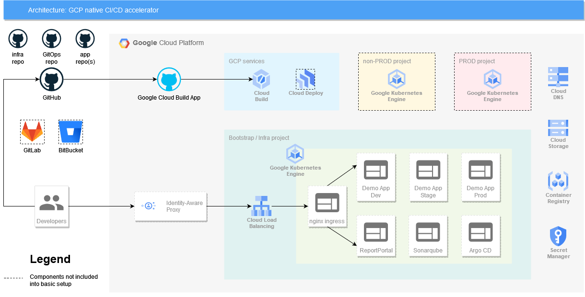

# GCP native CI/CD accelerator

* [CGP native CI/CD accelerator](./README.md)
   * [Introduction](./README.md#introduction)
   * [Architecture](./README.md#architecture)
* [Infrastructure Deployment](./docs/InfrastructureDeployment.md)
* [Post Deployment Steps](./docs/PostDeploymentSteps.md)
* [Infrastructure Cleanup](./docs/InfrastructureCleanup.md)
* [Service Account](./docs/ServiceAccount.md)
* [Creating Branches](./docs/CreatingBranches.md)
* [Repositories](./docs/Repositories.md)
* [Difference Between Demo and Production Deployment](./docs/DemoVsProdDeployment.md)
* [New Application Onboarding](./docs/NewApplicationOnboarding.md)

---

## Introduction

GCP native CI/CD accelerator is a product that brings a unified CI/CD approach with testing best practices out of the box and helps to manage infrastructure with a focus on code quality and security. In addition, it absorbs EPAM’s years of experience in designing and implementing CI/CD solutions for numerous clients across different business domains and countries.

Key points:

- supports ephemeral feature environments.
- adheres to CI/CD industry best practices.
- provides secure gateway for non-production application deployments.
- cost-efficient solution.
- quick and simple evaluation with demo mode.

## Architecture

Technologies used by GCP native CI/CD accelerator:

| Feature | Tools |
|---------|-------|
| VCSs for IaC hosting | GitHub |
| VCSs for applications code hosting | GitHub |
| Static code analysis for IaC | Checkov, Open Policy Agent, TFLint, TFSec |
| Static code analysis for applications | SonarQube |
| Pull request analysis (SonarQube) | GitHub |
| CI/CD | Google CloudBuild, Argo CD |
| Test results analysis and reporting | Report Portal |
| Infrastructure supported for application deployment | Google Kubernetes Engine |
